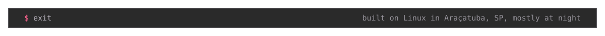

<!--
  Facts here mirror https://me.vinicioslugli.dev/llms-full.txt, which is the source of truth.
  Reconcile against it before editing so the profile and the portfolio never drift apart.
-->

<picture>
  <source media="(prefers-color-scheme: dark)" srcset="assets/banner-dark.svg">
  <source media="(prefers-color-scheme: light)" srcset="assets/banner-light.svg">
  
</picture>

Most of my repositories exist because something annoyed me and I refused to let it go. The rest exist because a hackathon or a college deadline got there first, and most of those hackathons ended in first place.

### me.lg

<picture></picture>

```
struct Dev {
    name: "Vinicios Lugli"
    city: "Araçatuba, SP"
    fuel: ["rust", "coffee coke", "ASMR Shy Bunny Girl"]

    fn react(self, problem) {
        if problem == "annoying" {
            return "build a tool"
        } elif problem == "impossible on windows" {  # linux is home, windows is a guest room for a few apps
            return "build a driver"
        }
        return "rewrite it in rust"
    }
}

let me = Dev {}
print(f"{me.name} // {me.city} // running on {me.fuel.len()} things")

for problem in ["annoying", "impossible on windows", "it already works"] {
    print(f"  {problem} -> {me.react(problem)}")
}
```

```console
$ lugli run me.lg
Vinicios Lugli // Araçatuba, SP // running on 3 things
  annoying -> build a tool
  impossible on windows -> build a driver
  it already works -> rewrite it in rust
```

That is not pseudocode. It runs, because [the language is mine too](https://github.com/ViniciosLugli/lugli-language).

### How hard can it be

<picture></picture>

Six of them, not the whole pile. The rest lives in [my repositories](https://github.com/ViniciosLugli?tab=repositories) and on [the portfolio](https://me.vinicioslugli.dev/), including a few I would rather explain in person.

| project | why it exists |
| --- | --- |
| **[luks2win](https://github.com/ViniciosLugli/luks2win)** | Windows could not read my LUKS2 disks. Now it can. Rust in userspace, WinFsp on top, and enough safeguards that I still trust it near a real disk. |
| **[Lugli](https://github.com/ViniciosLugli/lugli-language)** | First commit December 2021, before any coding agent existed to write it for me. Learning Rust by writing a language turned out to be an aggressive plan: Python's syntax, Rust's spine, a bytecode VM, eight crates deep. Trial by fire, and the fire won a few rounds. |
| **[ferris-tapper](https://github.com/ViniciosLugli/ferris-tapper)** | Bridges two interfaces and mirrors the traffic, because I wanted to know what my devices say about me when I am not looking. |
| **[CrabRolls](https://github.com/crabrolls-cartesi/crabrolls)** | Cartesi handed me a grant to make Rust dapps less painful. Shipped as a crate, with [docs](https://crabrolls-cartesi.github.io/crabrolls/) and a test harness that runs without spinning up a Cartesi machine. |
| **[image-processor](https://github.com/ViniciosLugli/image-processor)** | Rust and Actix behind nginx, Flutter on top, sessions and request logs in between. A whole product, mostly to see if one head could hold it. |
| **[Hakutaku](https://hakutaku.ai)** | The serious one. I was CTO of a B2B knowledge platform: RAG over vector PostgreSQL, answers that can point at where they came from. A pre-seed round and an accelerator followed. |

### The part that pays rent

<picture></picture>

When somebody is paying, it looks calmer. Python, TypeScript and Rust services, REST APIs and microservices, PostgreSQL and pgvector, Elasticsearch, data pipelines, AWS and Docker on Linux, which is what I develop on every day, and LLM work that has to stay grounded in real sources instead of vibes. Same person, fewer jokes in the commit messages.

### Say hi

<picture></picture>

[Portfolio](https://me.vinicioslugli.dev/) · [LinkedIn](https://www.linkedin.com/in/vinicioslugli/) · [X](https://x.com/ViniciosLugli) · [hi@vinicioslugli.dev](mailto:hi@vinicioslugli.dev)

Happy to talk architecture with anyone, hiring or otherwise.

<picture>
  <source media="(prefers-color-scheme: dark)" srcset="assets/footer-dark.svg">
  <source media="(prefers-color-scheme: light)" srcset="assets/footer-light.svg">
  
</picture>
